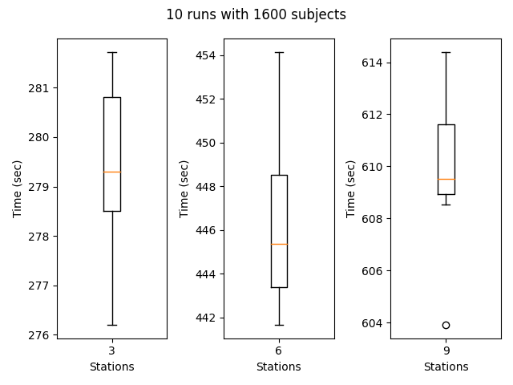
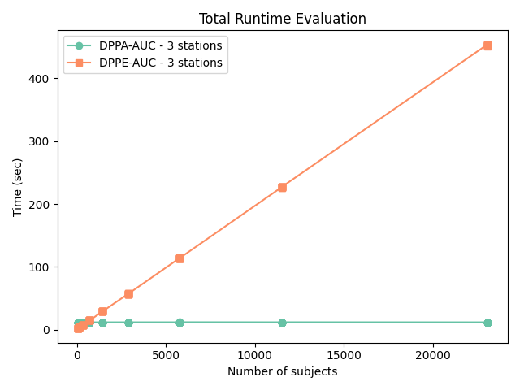

# DPPE-AUC
Distributed Privacy-Preserving exact - area under the curve; a novel method to compute the exact global AUC without revealing individual sensitive input data. It utilizes a combination of Paillier, symmetric, and asymmetric encryption with perfect randomized encoding to compute the exact measurement even with tie conditions. 
## Install requirements
Run `pip install -r requirements.txt` to ensure all requirements are fulfilled.

## Showcase
Sequence data of HIV-1 strains and the corresponding coreceptor binding of 10462 subjects was used. The raw data is from
www.hiv.lanl.gov and processed with `/showcase/data/data_preparing.py`. A binary classifier was trained and the performance
is evaluated against the commonly standard sklearn AUC library. Over 10 runs, the performance difference is within `e-16` which
is due to floating type conversions in python.

## Synthetic Data generation
Three different experiments are used to measure the performance.
To generate sample data, specify the number of stations and subjects. Afterwards 30-50% of fake subjects are added randomly.

## Experiments
The performance is evaluated against the commonly standard sklearn AUC library.

### Varying number of input parties
In experiment 1 the number of samples are identical, but the number of input parties varies.
The execution time is calculated absolute with each step and party for 10 runs. Therefore, the total execution time differs with the number of input parties.

### Varying number of input samples
In experiment 2 the number of samples are increasing with 3 stations.
The total execution increases with the number of samples to encrypt and decrypt.

