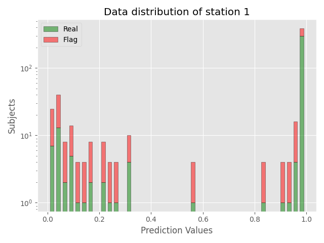
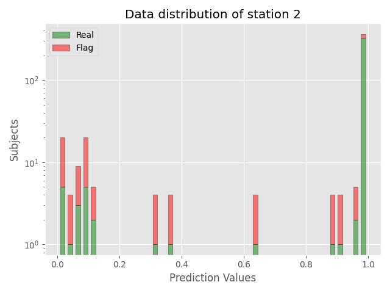
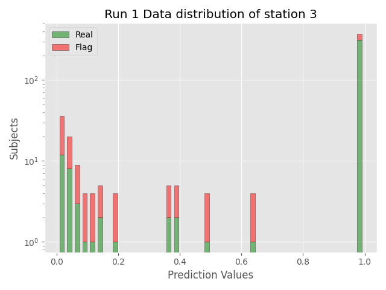
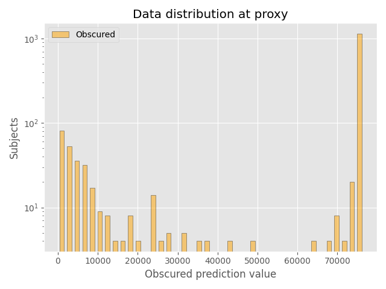
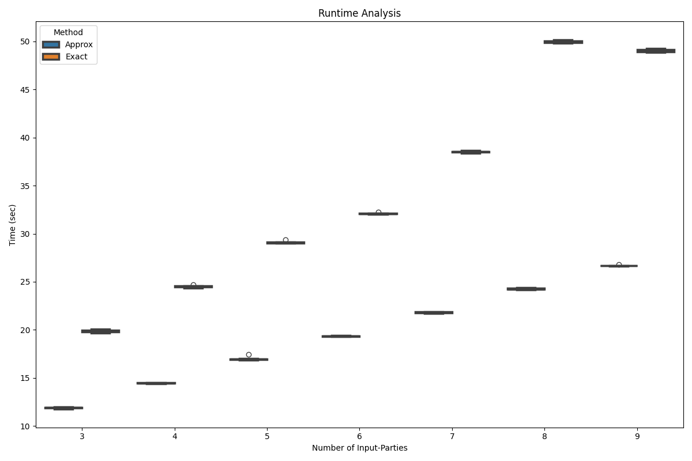

# DPPE-AUC
Distributed Privacy-Preserving exact - area under the curve; a novel method to compute the exact global AUC without revealing individual sensitive input data. It utilizes a combination of Paillier, symmetric, and asymmetric encryption with perfect randomized encoding to compute the exact measurement even with tie conditions. 
## Install requirements
Run `pip install -r requirements.txt` to ensure all requirements are fulfilled.

## Showcase
Sequence data of HIV-1 strains and the corresponding coreceptor binding of 10462 subjects was used. The raw data is from
www.hiv.lanl.gov and processed with `/showcase/data/data_preparing.py`. A binary classifier was trained and the performance
is evaluated against the commonly standard sklearn AUC library. Over 10 runs, the performance difference is within `e-16` which
is due to floating type conversions in python. Furthermore, a evaluation of the runtime regarding random number generation 
and flag data generation was done.

## Input and Obscured Data Figures

### **Input Data Figures**  
The **input data figures** illustrate the **real distribution** of prediction values across subjects.  

- **X-axis**: Prediction values (e.g., probabilities between 0 and 1).  
- **Y-axis**: Number of subjects (logarithmic scale where applicable).  
- The **green bars** represent real subjects (`Flag = 1`) with their associated prediction values.  
- These distributions can exhibit **biases** (e.g., values clustered around specific ranges, such as near 0 or 1) depending on the data.

- 
### **Obscured Data Figures**  
The **obscured data figures** aim to **hide the original input data distribution** while maintaining a minimal runtime overhead and threshold size:

- **Real Prediction Values**:  
   - The original real values (**green**) remain intact but are partially masked by synthetic data.  

- **Synthetic Data**:  
   - Represented by **red bars** (`Flag = 0`).  
   - Synthetic prediction values are **only generated at existing real prediction values** to avoid introducing new thresholds.  
   - The amount of synthetic data is configurable and kept minimal (e.g., 10%-50% of the real data).  

- **Goal**:  
   To obscure peaks or patterns in the real distribution while:  
   1. **Minimizing Information Leakage**: Synthetic data masks real peaks without altering the prediction value space.  
   2. **Maintaining Efficiency**: Minimal synthetic data introduces negligible computational overhead.

## Synthetic Data generation
Two experiments are used to measure the runtime with synthetic data.
To generate sample data, specify the number of stations and subjects. In the following experiments 10-60% of flag subjects are added randomly.

## Experiments
The performance is evaluated against the commonly standard sklearn AUC library and FHAUC method from TODO cite.

### Varying number of input parties
In experiment 1 the number of samples are identical, but the number of input parties varies.
The execution time is calculated absolute with each step and party for 10 runs. Therefore, the total execution time differs with the number of input parties.

### Varying number of input samples
In experiment 2 the number of samples are increasing with 3 stations.
The total execution increases with the number of samples to encrypt and decrypt.

