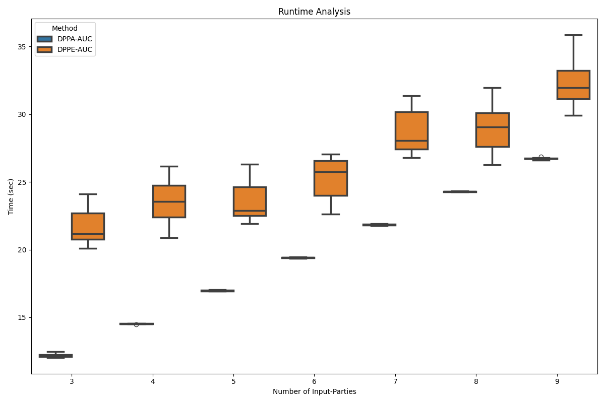

# PP-AUC

## DPPE-AUC
**Distributed Privacy-Preserving Exact - Area Under the Curve** (DPPE-AUC) is a novel method for calculating the exact
global AUC without exposing individual sensitive input data. The approach leverages a combination of Paillier encryption,
symmetric and asymmetric cryptography, and perfect randomized encoding to ensure privacy and accuracy, even in the
presence of tie conditions.

## DPPA-AUC
**Distributed Privacy-Preserving Approximation - Area Under the Curve** (DPPA-AUC) is another novel method for calculating the approximate
global AUC without exposing individual sensitive input data. The approximation method utilizes similar technologies but only approximates the AUC based on a preset number of decision points.

## Install requirements
Run `pip install -r requirements.txt` to ensure all requirements are fulfilled.

## Showcase
Sequence data of HIV-1 strains and the corresponding coreceptor binding of 10462 subjects was used. The raw data is from
www.hiv.lanl.gov and processed with `/showcase/data/data_preparing.py`. A binary classifier was trained and the performance
is evaluated against the commonly standard sklearn AUC library. Over 10 runs, the performance difference is within `e-16` which
is due to floating type conversions in python. Furthermore, a evaluation of the runtime regarding random number generation 
and flag data generation was done.

## Input and Obscured Data Figures

### **Input Data Figures**  
The **input data figures** illustrate the **real distribution** of prediction values across subjects.  

- **X-axis**: Prediction values (e.g., probabilities between 0 and 1).  
- **Y-axis**: Number of subjects (logarithmic scale where applicable).  
- The **green bars** represent real subjects (`Flag = 1`) with their associated prediction values.  
- These distributions can exhibit **biases** (e.g., values clustered around specific ranges, such as near 0 or 1) depending on the data.

### **Obscured Data Figures**  
The **obscured data figures** aim to **hide the original input data distribution** while maintaining a minimal runtime overhead and threshold size:

- **Real Prediction Values**:  
   - The original real values (**green**) remain intact but are partially masked by synthetic data.  

- **Synthetic Data**:  
   - Represented by **red bars** (`Flag = 0`).  
   - Synthetic prediction values are **only generated at existing real prediction values** to avoid introducing new thresholds.  
   - The amount of synthetic data is configurable and kept minimal (e.g., 10%-50% of the real data).  

- **Goal**:  
   To obscure peaks or patterns in the real distribution while:  
   1. **Minimizing Information Leakage**: Synthetic data masks real peaks without altering the prediction value space.  
   2. **Maintaining Efficiency**: Minimal synthetic data introduces negligible computational overhead.

## Synthetic Data generation
Two experiments are used to measure the runtime with synthetic data.
To generate sample data, specify the number of stations and subjects. In the following experiments 10-60% of flag subjects are added randomly.

## Experiments
The performance is evaluated by comparing the proposed method against the standard scikit-learn AUC library and the [FHAUC method](https://arxiv.org/pdf/2403.14428).

### Varying Number of Input Parties
In Experiment 1, the number of input samples remains constant, while the number of input parties varies.

The execution time is measured for each step and each party across 10 runs. As a result, the total execution time changes depending on the number of input parties involved. This provides insights into the scalability of the method with respect to the number of parties.

### Varying Number of Input Samples
In Experiment 2, the number of input samples increases while the setup remains fixed at 3 stations.

As the number of samples grows, the total execution time also increases due to the additional computational overhead required for encrypting and decrypting a larger volume of data.

#### Observed Differences
- **Exact Average Difference (over 90 runs):** `-1.2335811384723961e-17`  
  This demonstrates near-perfect consistency with negligible variation in results.

- **Approximate Average Difference (over 90 runs):** `-3.330596080498078e-05`  
  The slight variation in approximate results reflects the trade-off between computational efficiency and precision, with the differences remaining minimal.

